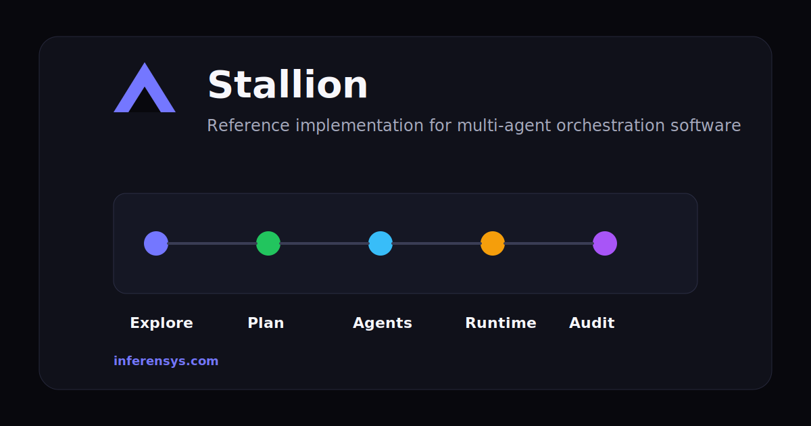
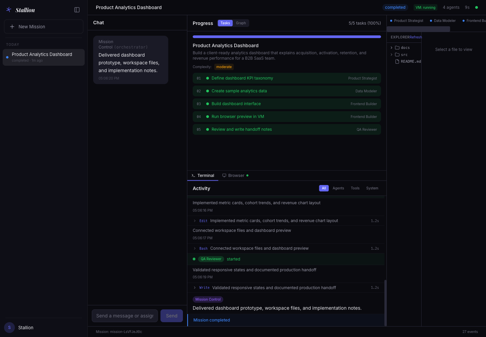

A Multi-Agent Orchestration platform that plans the work, assign agents, show the graph, run the job in a VM sandbox (E2B), and let a end-user user see what happened.

That is the thing teams usually discover they need after the first impressive prototype.

If you are building something closer to Devin, Claude Code, GitHub Copilot Workspace, or an internal version of Salesforce Agentforce, this repo is a useful starting point. 

It has:

- a planner agent that turns a request into description, agents and tasks
- a graph that shows dependencies instead of hiding them in chat
- QnA & review step before agents run
- realtime agent and tool activity

## The Demo

The sample task:

> Build a product analytics dashboard for a B2B SaaS company. Include acquisition, activation, retention, and revenue metrics, charts, and implementation notes.

Short video:

[Watch the mission run](docs/stallion-mission-control-run.mp4)

## What Matters

### The plan is explicit

Before anything runs, Stallion creates agents, task ownership, dependencies, and acceptance criteria.

That matters. A lot of agent products skip this and go straight from prompt to chaos.


### The graph shows the work

You can see what each agent owns, what is blocked, and what completed.

This is the part a CTO, platform lead, or ops team will care about after the novelty wears off.


### The output is inspectable

Agent activity, runtime preview, files, and notes are visible in one place.

No guessing. No “trust me, it ran.”



## Why This Exists

Chat is a bad control plane for serious agent work.

It is fine for asking a question. It is weak for assigning work across multiple agents, reviewing a plan, handling credentials, tracking state, or explaining why a job did what it did.

Stallion is a rough but concrete answer to that problem.

Three examples where this pattern fits:

- A fintech team wants agents to review Stripe, Postgres, and customer-support data before drafting a collections workflow.
- A devtools company wants a GitHub + Linear coding agent that can split work across planner, backend, frontend, and QA agents.
- A healthcare ops team wants prior-auth packets assembled by agents, but with a human approval step before anything leaves the system.

Different domains. Same shape: plan, agents, graph, sandbox, review.

## How It Works

```text
Prompt -> Explore -> Plan -> Approve -> Execute -> Inspect
```

Packages:

| Package | What it does |
| --- | --- |
| `@stallion/frontend` | Next.js app, dashboard, graph UI, workspace inspector |
| `@stallion/backend` | Hono API, Socket.IO events, mission state, sandbox coordination |
| `@stallion/shared` | Zod schemas for agents, tasks, events, and sandbox state |
| `@stallion/agent-runtime` | Planner and orchestrator on top of the Claude Agent SDK |
| `@stallion/agent-control` | Container control server for sandboxed agent runs |

Core pieces:

- Next.js 15
- React 19
- Tailwind CSS
- Hono
- Socket.IO
- Zod
- Zustand
- React Flow
- Docker
- Claude Agent SDK

## Run It

You need Node.js 22+ and Docker.

```bash
npm install
cp .env.example .env
```

Add your model credentials to `.env`.

Build the agent container:

```bash
docker build -t stallion-agent-control:latest packages/agent-control
```

Start the backend:

```bash
DEV_AUTH_BYPASS=true npm run dev:backend
```

Start the frontend:

```bash
NEXT_PUBLIC_DEV_AUTH_BYPASS=true \
NEXT_PUBLIC_BACKEND_URL=http://localhost:4000 \
npm run dev:frontend
```

Open:

```text
http://localhost:3000
```

## Environment

Start with `.env.example`.

The important ones:

| Variable | Why it exists |
| --- | --- |
| `DEV_AUTH_BYPASS` | local backend user |
| `NEXT_PUBLIC_DEV_AUTH_BYPASS` | local frontend user |
| `SUPABASE_URL` | production auth |
| `NEXT_PUBLIC_SUPABASE_URL` | frontend Supabase URL |
| `NEXT_PUBLIC_SUPABASE_ANON_KEY` | frontend Supabase anon key |
| `ANTHROPIC_FOUNDRY_RESOURCE` | Azure AI Foundry resource |
| `ANTHROPIC_FOUNDRY_API_KEY` | Azure AI Foundry key |
| `ANTHROPIC_DEFAULT_SONNET_MODEL` | default agent model |
| `ANTHROPIC_DEFAULT_OPUS_MODEL` | stronger planning model |

## If You Build From This

The first things to tighten:

- replace dev auth with SSO or your normal identity provider
- define which tools each agent can use
- lock down sandbox networking
- set run time and spend limits
- store events and artifacts somewhere durable
- decide which actions require approval

Do those before pointing agents at production data.

## Work With Us

Stallion is a practical starting point for teams building multi-agent products, internal agent platforms, or vertical AI operations tools.


If that is what you are working on, talk to [Inferensys](https://inferensys.com/).

Contact Us: https://inferensys.com/contact