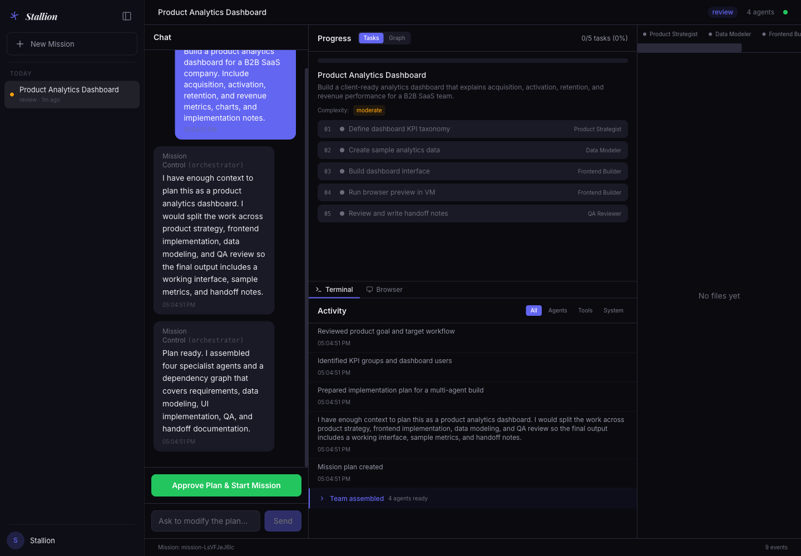
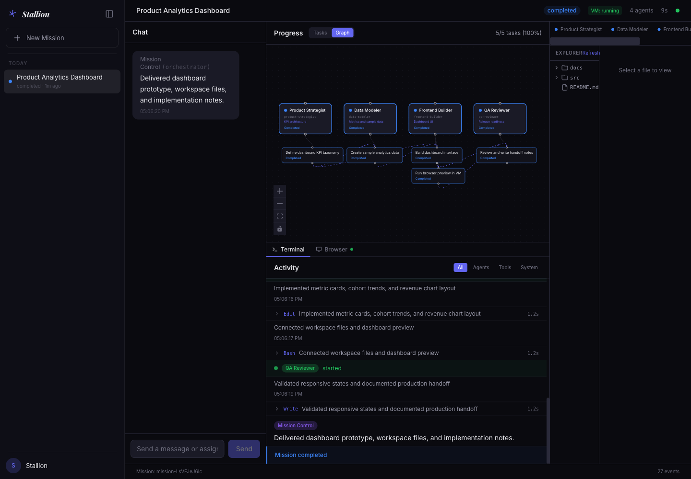
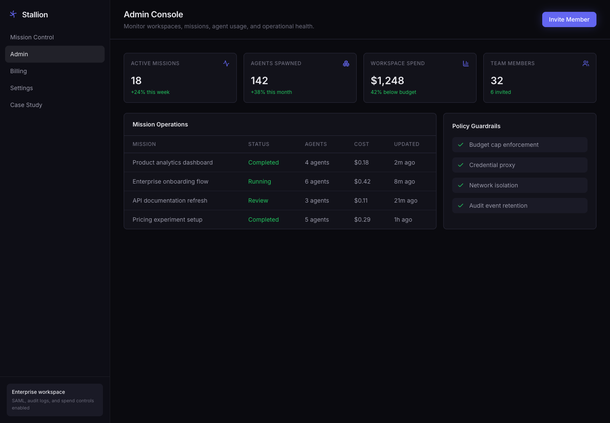
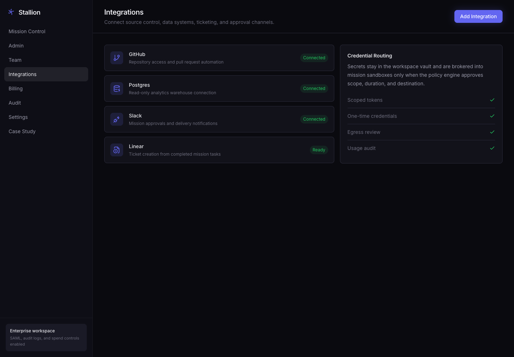
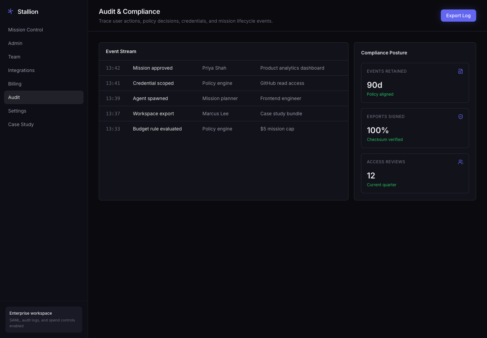

# Stallion


Stallion is a reference implementation for multi-agent orchestration software.

It shows how an agentic AI application can move from a broad request to a reviewed plan, a team of specialist agents, parallel task execution, sandboxed runtime output, and an auditable handoff.

This repo is useful for teams evaluating or building:

- multi-agent orchestration platforms
- agentic workflow automation
- human-in-the-loop AI systems
- sandboxed AI agent execution
- agent workflow graphs and task dependency UIs
- enterprise AI agent dashboards
- approval, audit, and governance layers for AI agents

## Demo Task

> Build a product analytics dashboard for a B2B SaaS company. Include acquisition, activation, retention, and revenue metrics, charts, and implementation notes.

Video:

- [Mission control run](case-study/restored-ui/stallion-mission-control-run.mp4)

## Product Walkthrough

### 1. Review the Agent Plan

The planner turns the request into named agents, task ownership, dependencies, and acceptance criteria before any work starts.



### 2. Track Parallel Execution

The workflow graph shows which agents own which tasks, what is blocked, and what has completed.



### 3. Inspect Runtime Output

The dashboard combines task progress, agent activity, runtime preview, and generated workspace files in one control surface.


### 4. Operate the Workspace

Admins need usage, spend, mission status, and policy guardrails without leaving the product.



### 5. Connect Tools Safely

Integrations and credential routing are treated as first-class workflow controls, not hidden setup steps.



### 6. Keep an Audit Trail

Sensitive agent workflows need traceable approvals, credential events, exports, and policy decisions.



## What It Demonstrates

Stallion is not a chatbot UI. It is an orchestration layer for agent work.

The main flow:

1. A user describes the work.
2. The system explores the request and estimates readiness.
3. A structured plan is created with agents, tasks, dependencies, and acceptance criteria.
4. A human reviews and approves the plan.
5. Agents execute work in parallel where dependencies allow it.
6. Runtime events stream into the UI.
7. The user inspects task progress, agent activity, generated files, and the runtime preview.

The product surface also includes authentication, team management, billing, integrations, audit, and workspace security settings.

## Architecture

```text
Prompt -> Explore -> Plan -> Approve -> Execute -> Inspect -> Handoff
```

Packages:

| Package | Purpose |
| --- | --- |
| `@stallion/frontend` | Next.js app, mission dashboard, graph UI, workspace inspector |
| `@stallion/backend` | Hono API, Socket.IO event stream, mission state, sandbox coordination |
| `@stallion/shared` | Zod schemas for missions, agents, tasks, events, and sandbox state |
| `@stallion/agent-runtime` | Planner and orchestrator built on the Claude Agent SDK |
| `@stallion/agent-control` | Container control server for sandboxed agent sessions |

Core implementation details:

- Next.js 15, React 19, Tailwind CSS
- Hono API server
- Socket.IO realtime mission updates
- Zod shared contracts
- Zustand client state
- React Flow workflow graph
- Docker-based agent sandbox
- Credential proxy so real API keys do not enter the container
- Claude Agent SDK execution path

## Run Locally

Requirements:

- Node.js 22+
- Docker
- Azure AI Foundry credentials for Claude models, or compatible Claude Agent SDK configuration

Install dependencies:

```bash
npm install
cp .env.example .env
```

Build the agent control image:

```bash
docker build -t stallion-agent-control:latest packages/agent-control
```

Start the backend:

```bash
DEV_AUTH_BYPASS=true npm run dev:backend
```

Start the frontend:

```bash
NEXT_PUBLIC_DEV_AUTH_BYPASS=true \
NEXT_PUBLIC_BACKEND_URL=http://localhost:4000 \
npm run dev:frontend
```

Open:

```text
http://localhost:3000
```

For the portfolio view:

```bash
NEXT_PUBLIC_DEV_AUTH_BYPASS=true \
NEXT_PUBLIC_PORTFOLIO_MODE=true \
NEXT_PUBLIC_BACKEND_URL=http://localhost:4000 \
npm run dev:frontend
```

Then visit:

```text
http://localhost:3000/portfolio
```

## Environment

Use `.env.example` as the starting point.

Important variables:

| Variable | Purpose |
| --- | --- |
| `DEV_AUTH_BYPASS` | Use a local development user for backend routes |
| `NEXT_PUBLIC_DEV_AUTH_BYPASS` | Use a local development user in the frontend |
| `SUPABASE_URL` | Supabase project URL for production auth |
| `NEXT_PUBLIC_SUPABASE_URL` | Supabase URL exposed to the frontend |
| `NEXT_PUBLIC_SUPABASE_ANON_KEY` | Supabase anon key exposed to the frontend |
| `ANTHROPIC_FOUNDRY_RESOURCE` | Azure AI Foundry resource name |
| `ANTHROPIC_FOUNDRY_API_KEY` | Azure AI Foundry API key |
| `ANTHROPIC_DEFAULT_SONNET_MODEL` | Default execution model |
| `ANTHROPIC_DEFAULT_OPUS_MODEL` | More capable planning model |
| `NEXT_PUBLIC_PORTFOLIO_MODE` | Enables the public portfolio surfaces |

## Production Notes

Before using this pattern in a real client environment:

- replace development auth bypass with Supabase, SSO, or the client identity provider
- define tool permissions per agent role
- restrict sandbox networking
- set time and cost limits per run
- persist events and artifacts in durable storage
- add audit export and incident review flows
- tune approval rules for sensitive tools, credentials, and deployment actions

## Case Study Assets

The shareable case study bundle is in [case-study/restored-ui](case-study/restored-ui).

It includes screenshots, product tour videos, and a short summary of the demo flow.

## Work With Us

Stallion is a reference implementation for companies planning custom agentic workflow software.

If you are building a multi-agent orchestration product, an internal agent platform, or a vertical AI operations system, contact [Inferensys](https://inferensys.com/).
